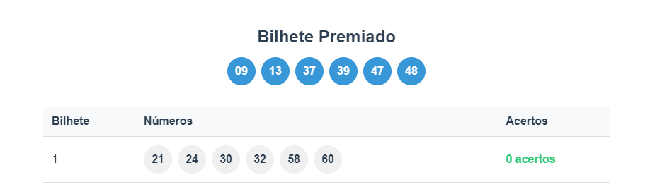

# 📑 Sumário
- [💡 Sobre o Projeto](#-sobre-o-projeto)
  - [Funcionalidades](#funcionalidades)
- [🚀 Tecnologias Utilizadas](#-tecnologias-utilizadas)
- [📋 Requisitos](#-requisitos)
- [🛠️ Instalação](#️-instalação)
- [📚 API](#api)
  - [Endpoints](#endpoints)
- [🏗️ Arquitetura](#️-arquitetura)
- [👥 Autor](#-autor)
- [👨‍💻 Para Desenvolvedores](#-para-desenvolvedores)
  - [Entrar no Container](#entrar-no-container)
  - [Executar PHP CS Fixer](#executar-php-cs-fixer)


# Loteria - API de Sorteios

API para geração e verificação de bilhetes de loteria.

## 💡 Sobre o Projeto

Esta API permite a geração de bilhetes de loteria, além de realizar sorteios e verificar os resultados. O sistema foi desenvolvido seguindo princípios SOLID, Clean Architecture e boas práticas de programação.

### Funcionalidades

- ✨ Geração de bilhete premiado (6 dezenas entre 01 e 60)
- 🎫 Geração de múltiplos bilhetes (até 50 bilhetes)
- 🔢 Suporte a bilhetes com 6 a 10 dezenas
- 📊 Visualização dos resultados em tabela HTML estilizada
- ✅ Verificação automática de acertos

## 🚀 Tecnologias Utilizadas

- PHP 8.4+
- Docker & Docker Compose
- PHPUnit para testes
- Apache como servidor web

<p style="text-align: left;">
    
    
    
</p>

## 📋 Requisitos

- Docker
- Docker Compose
- Git

## 🛠️ Instalação

1. Clone o repositório:

```bash
git clone https://github.com/junionestor/lottery.git
cd lottery
```

2. Inicie os containers:

```bash
docker compose up -d
```

3. Instale as dependências:

```bash
docker compose exec app composer install
```

Pronto! A Api já está rodando em `localhost:8000/api.php`

## 📚API
Endpoints:
- <span style="color: #49cc90;">POST</span><code> localhost:8000/api.php/draw</code>: gera o sorteio para uma requisição.
```json
// body
{
    "quantity": 1,
    "numbers_per_ticket": 10
}

// quantity: quantidade de bilhetes a serem gerados
// numbers_per_ticket: quantidade de dezenas geradas em cada bilhete
```
```json
// response
{
    "success": true,
    "data": {
        "winning_ticket": {
            "numbers": [1, 2, 3, 4, 5, 6],
            "formatted": "01-02-03-04-05-06"
        },
        "tickets": [
            {
                "numbers": [1, 2, 3, 4, 5, 6],
                "formatted": "01-02-03-04-05-06",
                "matches": 6
            }
        ],
        "results_table": "<table>...</table>"
    },
    "error": null
// success: booleano se a requisição foi realizada com sucesso
// data:
//  winning_ticket: bilhete premiado
//  tickets: bilhete(s) gerado(s)
//  results_table: tabela com a conferência dos resultados
}
```

- <span style="color: #49cc90;">POST</span><code> localhost:8000/api.php/draw/table</code>: gera o sorteio para uma requisição em formato HTML.
```json
// body
{
    "quantity": 1,
    "numbers_per_ticket": 10
}

// quantity: quantidade de bilhetes a serem gerados
// numbers_per_ticket: quantidade de dezenas geradas em cada bilhete
```
```html
<!DOCTYPE html>
<html lang="pt-BR">

<head>
    ...
</head>

<body>
    <table>...</table>
</html>
```



## 🏗️ Arquitetura

O projeto segue os princípios da Clean Architecture:

```
src/
├── Domain/           # Regras de negócio e entidades
├── Application/      # Casos de uso da aplicação
├── Infrastructure/   # Controllers e implementações concretas
└── Presentation/     # Visualização (HTML)
```

## 👥 Autor

Nestor Júnio

### 👨‍💻 Para Desenvolvedores
###### Entrar no Container
Para entrar no container do aplicativo, execute:
```bash
docker compose exec app bash
```

###### Executar PHP CS Fixer
Para executar o PHP CS Fixer e corrigir o código na pasta 📁src, execute:
```bash
./vendor/bin/php-cs-fixer fix src
```
